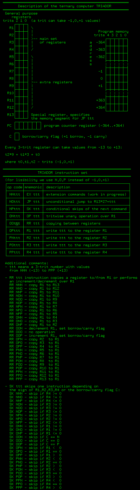

# Ternary computer program emulator

Many claimed to build a ternary computer, however nobody (to the best of my knowledge) completed the project. Triador project makes no empty promises!

I am building a very simple but functional 3-trit balanced ternary computer. The only building block allowed is a ternary multiplexer based on DG403 analog switches. Check this youtube mini-series about the hardware:

[](https://www.youtube.com/playlist?list=PL9MBW6e0V7UIvP2vY_aKwsu93wqYq5jXJ)

This repository contains a program emulator that eases the debugging of the hardware.

# compile and execute a sample program
```sh
git clone https://github.com/ssloy/triador.git
cd triador
mkdir build
cd build
cmake ..
make
./triador ../prog/add.txt
```

This executes [a very simple program](prog/add.txt) that writes two numbers to the registers R2 and R3 and computes their sum.
The result is stored in R3.
The emulator drops the computer state for all steps.

Here is the execution log:
```
$ ./triador ../prog/add.txt
 R1  R2  R3  R4  R5  R6  R7  R8  R9 R10 R11 R12 R13  C   PC
  0   0   0   0   0   0   0   0   0   0   0   0   0  0  -364

 R1  R2  R3  R4  R5  R6  R7  R8  R9 R10 R11 R12 R13  C   PC
-13   0   0   0   0   0   0   0   0   0   0   0   0  0  -363

 R1  R2  R3  R4  R5  R6  R7  R8  R9 R10 R11 R12 R13  C   PC
-13   0   0   0   0   0   0   0   0   0   0   0 -13  0  -362

 R1  R2  R3  R4  R5  R6  R7  R8  R9 R10 R11 R12 R13  C   PC
-13  -2   0   0   0   0   0   0   0   0   0   0 -13  0  -361

 R1  R2  R3  R4  R5  R6  R7  R8  R9 R10 R11 R12 R13  C   PC
-13  -2  13   0   0   0   0   0   0   0   0   0 -13  0  -360

 R1  R2  R3  R4  R5  R6  R7  R8  R9 R10 R11 R12 R13  C   PC
 13  -2  13   0   0   0   0   0   0   0   0   0 -13  0  -359

 R1  R2  R3  R4  R5  R6  R7  R8  R9 R10 R11 R12 R13  C   PC
 13  -2  13   0   0   0   0   0   0   0   0   0 -13  0  -357

 R1  R2  R3  R4  R5  R6  R7  R8  R9 R10 R11 R12 R13  C   PC
 13  -2  13   0   0   0   0   0   0   0   0   0 -13  0  -356

 R1  R2  R3  R4  R5  R6  R7  R8  R9 R10 R11 R12 R13  C   PC
 12  -2  13   0   0   0   0   0   0   0   0   0 -13  0  -355

 R1  R2  R3  R4  R5  R6  R7  R8  R9 R10 R11 R12 R13  C   PC
 12  -2  13   0   0   0   0   0   0   0   0   0 -13  0  -353

 R1  R2  R3  R4  R5  R6  R7  R8  R9 R10 R11 R12 R13  C   PC
 12  -2  12   0   0   0   0   0   0   0   0   0 -13  0  -352

 R1  R2  R3  R4  R5  R6  R7  R8  R9 R10 R11 R12 R13  C   PC
 -2  -2  12   0   0   0   0   0   0   0   0   0 -13  0  -351

 R1  R2  R3  R4  R5  R6  R7  R8  R9 R10 R11 R12 R13  C   PC
 -2  -2  12   0   0   0   0   0   0   0   0   0 -13  0  -350

 R1  R2  R3  R4  R5  R6  R7  R8  R9 R10 R11 R12 R13  C   PC
 -1  -2  12   0   0   0   0   0   0   0   0   0 -13  0  -349

 R1  R2  R3  R4  R5  R6  R7  R8  R9 R10 R11 R12 R13  C   PC
 -1  -2  12   0   0   0   0   0   0   0   0   0 -13  0  -347

 R1  R2  R3  R4  R5  R6  R7  R8  R9 R10 R11 R12 R13  C   PC
 -1  -1  12   0   0   0   0   0   0   0   0   0 -13  0  -346

 R1  R2  R3  R4  R5  R6  R7  R8  R9 R10 R11 R12 R13  C   PC
 -1  -1  12   0   0   0   0   0   0   0   0   0 -13  0  -360

 R1  R2  R3  R4  R5  R6  R7  R8  R9 R10 R11 R12 R13  C   PC
 12  -1  12   0   0   0   0   0   0   0   0   0 -13  0  -359

 R1  R2  R3  R4  R5  R6  R7  R8  R9 R10 R11 R12 R13  C   PC
 12  -1  12   0   0   0   0   0   0   0   0   0 -13  0  -357

 R1  R2  R3  R4  R5  R6  R7  R8  R9 R10 R11 R12 R13  C   PC
 12  -1  12   0   0   0   0   0   0   0   0   0 -13  0  -356

 R1  R2  R3  R4  R5  R6  R7  R8  R9 R10 R11 R12 R13  C   PC
 11  -1  12   0   0   0   0   0   0   0   0   0 -13  0  -355

 R1  R2  R3  R4  R5  R6  R7  R8  R9 R10 R11 R12 R13  C   PC
 11  -1  12   0   0   0   0   0   0   0   0   0 -13  0  -353

 R1  R2  R3  R4  R5  R6  R7  R8  R9 R10 R11 R12 R13  C   PC
 11  -1  11   0   0   0   0   0   0   0   0   0 -13  0  -352

 R1  R2  R3  R4  R5  R6  R7  R8  R9 R10 R11 R12 R13  C   PC
 -1  -1  11   0   0   0   0   0   0   0   0   0 -13  0  -351

 R1  R2  R3  R4  R5  R6  R7  R8  R9 R10 R11 R12 R13  C   PC
 -1  -1  11   0   0   0   0   0   0   0   0   0 -13  0  -350

 R1  R2  R3  R4  R5  R6  R7  R8  R9 R10 R11 R12 R13  C   PC
  0  -1  11   0   0   0   0   0   0   0   0   0 -13  0  -349

 R1  R2  R3  R4  R5  R6  R7  R8  R9 R10 R11 R12 R13  C   PC
  0  -1  11   0   0   0   0   0   0   0   0   0 -13  0  -347

 R1  R2  R3  R4  R5  R6  R7  R8  R9 R10 R11 R12 R13  C   PC
  0   0  11   0   0   0   0   0   0   0   0   0 -13  0  -346

 R1  R2  R3  R4  R5  R6  R7  R8  R9 R10 R11 R12 R13  C   PC
  0   0  11   0   0   0   0   0   0   0   0   0 -13  0  -360

 R1  R2  R3  R4  R5  R6  R7  R8  R9 R10 R11 R12 R13  C   PC
 11   0  11   0   0   0   0   0   0   0   0   0 -13  0  -359

 R1  R2  R3  R4  R5  R6  R7  R8  R9 R10 R11 R12 R13  C   PC
 11   0  11   0   0   0   0   0   0   0   0   0 -13  0  -358

 R1  R2  R3  R4  R5  R6  R7  R8  R9 R10 R11 R12 R13  C   PC
 11   0  11   0   0   0   0   0   0   0   0   0 -13  0  -345
```

Triador has the following instruction set:


